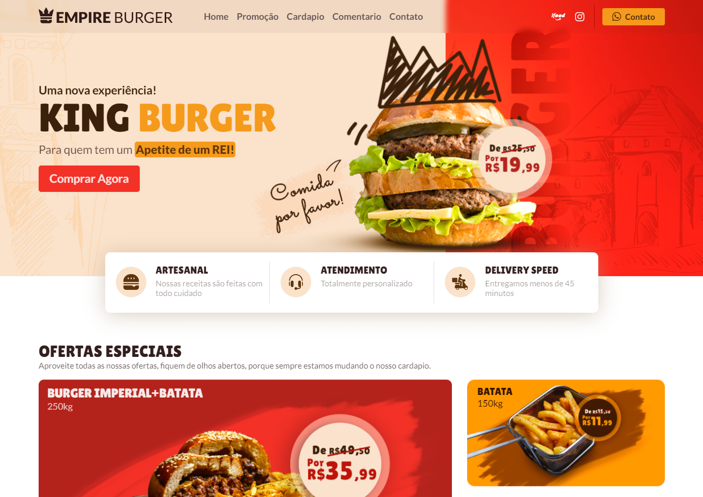
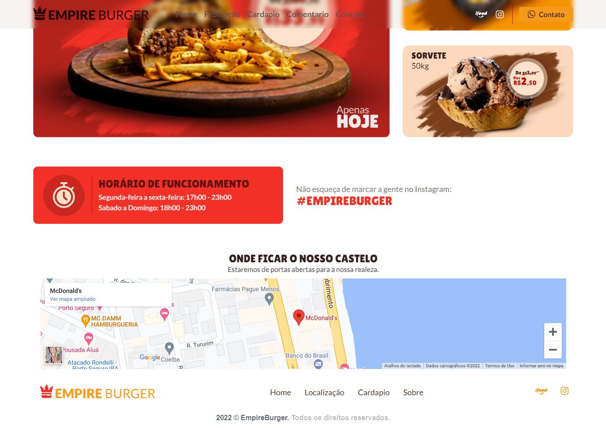

## 💻 Projeto

Esse projeto é uma landing page de uma hamburgueria fictícia chamada Empire Burger, nela há seções sobre as ofertas especiais, horário de funcionamento e a localização do estabelecimento. O seu desafio foi construir este layout e deixá-lo o mais próximo possível do design original.

## 🚀 Tecnologias

- [HTML](https://developer.mozilla.org/pt-BR/docs/Web/HTML)
- [SASS](https://sass-lang.com)

## 📝 Funcionalidades

- Criar as seguintes seções: Menu, Banner hero, Ofertas especiais, Onde fica o nosso castelo, Footer.
- Ao clicar em um item do menu, o usuário deverá ser levado para a seção correspondente.
- Na seção Ofertas especiais os elementos devem ser organizados com o uso da propriedade display:grid do css.
- As informações do card da oferta(nome do prato e gramagem) devem estar no html, a única imagem deve ser a foto do prato com o preço.
- Na seção Onde fica o nosso castelo você deverá incorporar uma localização do google maps.

## 💻 Plataforma do desafio & informações

- [BRCHALLENGES](https://www.brchallenges.com)

Plataforma criada no intuito de apresentar desafios para desenvolvedores front-end que estão iniciando na carreira.

Autor da plataforma: [Leo Vargas](https://github.com/leovargasdev)

Figma: [Projeto](https://www.figma.com/file/ag4Az50adOF53pBrwI0wFg?node-id=0:1)

Autor do designer da pagina: [Tiago Alves](https://www.behance.net/tiagofenixe9d9)

[Link da pagina](https://clintonrocha98.github.io/empire-burguer/)

  
</img>

  
</img>
